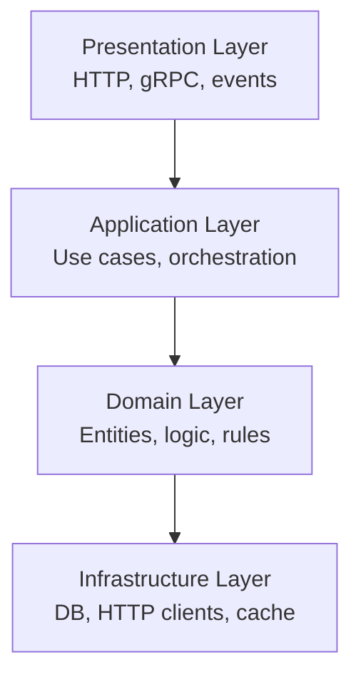
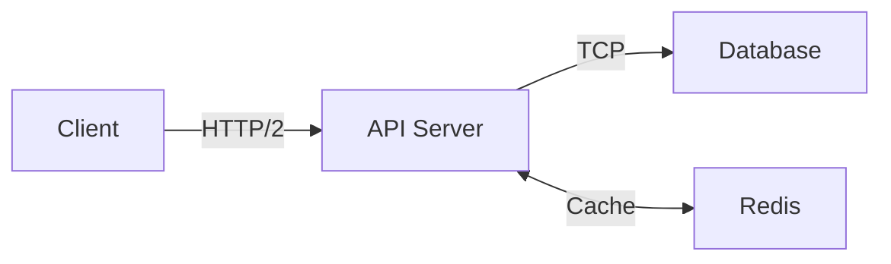

## Layered Architecture

Layered (N-tier) architecture organizes code into horizontal layers — Presentation, Application, Domain, Infrastructure — with dependencies flowing in one direction.

### Architecture Layers



### Key Characteristics

- Separation of concerns is the primary benefit
- Presentation → Application → Domain → Infrastructure: the standard clean architecture
- Strict layering prevents spaghetti dependencies at the cost of some verbosity
- Domain layer is the core: no framework, no database, just business logic
- Repository pattern abstracts persistence from the domain layer
- Transaction scripts (CRUD) can use a simple 3-tier without a rich domain layer

<Tip>
Enforce layer boundaries with ArchUnit (Java) or NetArchTest (.NET) in CI — catching violations automatically prevents boundary erosion over time.
</Tip>

### Best Practices

<CardGroup cols={2}>
  <Card title="Do" icon="check">
    - Enforce layer boundaries via automated architecture tests
    - Keep the domain layer free of framework imports
    - Use the Application layer for transaction management
  </Card>
  <Card title="Don't" icon="xmark">
    - Allow the presentation layer to call the infrastructure layer directly
    - Put domain logic in controllers or repository implementations
    - Use strict layering when a CRUD service has no meaningful domain
  </Card>
</CardGroup>

## Microservices Architecture

Microservices decompose applications into small, independently deployable services aligned to business capabilities, communicating over APIs or events.

### Core Principles

- **Single responsibility**: One bounded context per service
- **Independent deployability**: Services can be deployed without affecting others
- **Decoupled data stores**: Each service owns its data
- **Conway's Law**: Services map to team boundaries

```yaml
# Microservices Architecture
API Gateway → auth, rate-limit, route
    → Order Service     (PostgreSQL)
    → Inventory Service  (MongoDB)
    → Payment Service   (PostgreSQL)
    → Notification Svc  (Redis)

Kafka ← Order Service publishes OrderPlaced
       → Inventory Service consumes → reserves stock
       → Notification Service → sends email
```

### Key Components

<CardGroup cols={2}>
  <Card title="API Gateway" icon="door-open">
    Unified entry point with auth, rate limiting, routing
  </Card>
  <Card title="Service Mesh" icon="network-wired">
    Handles cross-cutting: mTLS, circuit breaking, observability (Istio, Linkerd)
  </Card>
  <Card title="Event Bus" icon="arrows-split-up-and-left">
    Async communication between services (Kafka, RabbitMQ)
  </Card>
  <Card title="Service Registry" icon="book">
    Dynamic service discovery (Consul, Eureka)
  </Card>
</CardGroup>

<Warning>
Start with a modular monolith and extract microservices at seams that justify the operational cost — premature microservices are the most common distributed systems mistake.
</Warning>

### Microservices Best Practices

**Do:**
- Own one database per service — never share schemas
- Implement circuit breakers for all inter-service calls
- Use correlation IDs for distributed tracing across services
- Apply the Saga pattern for distributed transactions

**Don't:**
- Create a distributed monolith by sharing databases
- Call services synchronously in a long chain (cascading failures)
- Adopt microservices without container orchestration capability

<Tip>
Service size heuristic: "could it be owned by a two-pizza team?"
</Tip>

## Serverless Architecture

Serverless (FaaS) runs code in response to events without managing servers. Cloud providers handle scaling, patching, and availability automatically.

### Key Characteristics

- **Functions are stateless**: No shared memory between invocations
- **Cold start**: First invocation after idle period incurs startup latency (~100ms-2s)
- **Event-driven**: Functions respond to HTTP, queues, storage events
- **Pay per invocation**: Economic for sporadic workloads
- **Auto-scaling**: From zero to thousands of concurrent executions

```typescript
// AWS Lambda handler (TypeScript)
export const handler = async (event: APIGatewayEvent) => {
    const { orderId } = event.pathParameters;
    const order = await db.getOrder(orderId);
    return { 
      statusCode: 200, 
      body: JSON.stringify(order) 
    };
};
```

### Serverless Patterns

<Tabs>
  <Tab title="API Gateway + Lambda">
    REST API backed by Lambda functions for stateless request handling.
  </Tab>
  
  <Tab title="Event Processing">
    S3/SNS/SQS triggers Lambda for async event processing.
  </Tab>
  
  <Tab title="Step Functions">
    Orchestrate stateful workflows across multiple Lambda functions.
  </Tab>
  
  <Tab title="Edge Functions">
    Run code at CDN edge locations (CloudFront Functions, Cloudflare Workers).
  </Tab>
</Tabs>

<Tip>
Use provisioned concurrency for latency-sensitive Lambda functions and reserve on-demand for background/async processing to balance cost and performance.
</Tip>

### Best Practices

<CardGroup cols={2}>
  <Card title="Do" icon="check">
    - Keep function handlers thin — business logic in a separate module
    - Use Step Functions for multi-step orchestration
    - Monitor cold starts and set concurrency limits
  </Card>
  <Card title="Don't" icon="xmark">
    - Put long-running processes (>15 min) in Lambda functions
    - Share state between Lambda invocations via in-memory variables
    - Ignore timeout limits for database-heavy operations
  </Card>
</CardGroup>

## Service-Oriented Architecture (SOA)

SOA structures enterprise systems as interoperable services communicating over a shared bus (ESB). It is the predecessor to microservices, emphasizing reuse and governance.

### ESB (Enterprise Service Bus)

Central integration backbone providing:

- **Routing**: Message routing based on content or rules
- **Transformation**: Schema and protocol conversion
- **Orchestration**: Multi-service workflow coordination
- **Protocol Mediation**: SOAP, REST, MQ, FTP interoperability

```yaml
Client → ESB (MuleSoft / IBM MQ)
         → route by message type
         → transform schema (canonical model)
         → Order Service (SOAP/WSDL)
         → ERP System (SAP)
         → CRM System (Salesforce)
         → log, monitor, alert
```

### SOA vs Microservices

| Aspect | SOA | Microservices |
|--------|-----|---------------|
| Communication | ESB (smart pipe) | API Gateway (dumb pipe) |
| Services | Coarse-grained | Fine-grained |
| Data | Shared databases | Database per service |
| Governance | Centralized | Decentralized |
| Standards | SOAP/WSDL/WS-* | REST/gRPC/Events |

<Tip>
When modernizing a legacy SOA system, use the Strangler Fig pattern — route new traffic to new microservices while keeping the ESB for legacy integrations.
</Tip>

## Distributed Systems Patterns

Building distributed systems means accepting the Eight Fallacies of Distributed Computing (network is reliable, latency is zero, etc.).

### Core Patterns

<CardGroup cols={2}>
  <Card title="Leader Election" icon="crown">
    Raft consensus powers etcd (Kubernetes), CockroachDB, TiKV
  </Card>
  <Card title="Consistent Hashing" icon="circle-nodes">
    Minimizes resharding in distributed caches (Redis Cluster)
  </Card>
  <Card title="Gossip Protocol" icon="comments">
    Membership and failure detection in clusters (Cassandra)
  </Card>
  <Card title="Saga Pattern" icon="diagram-project">
    Coordinates distributed transactions across services
  </Card>
</CardGroup>

### Idempotency Pattern

Idempotency is mandatory for any retried distributed operation.

```typescript
// Idempotency key pattern (prevents duplicate processing)
async function processPayment(request: PaymentRequest) {
    const key = request.idempotencyKey;
    if (await cache.exists(key)) {
        return await cache.get(key); // return cached result
    }
    const result = await stripe.charge(request);
    await cache.set(key, result, '24h');
    return result;
}
```

<Warning>
Design every consumer of a message queue or event bus to be idempotent from day one — at-least-once delivery guarantees duplicates will arrive eventually.
</Warning>

### Distributed Systems Best Practices

**Do:**
- Add correlation IDs to every distributed call
- Implement idempotency keys for all mutation operations
- Use exponential backoff with jitter for retry logic
- Implement distributed tracing (OpenTelemetry)

**Don't:**
- Assume the network is reliable or latency is consistent
- Design synchronous long chains across services
- Use distributed transactions (2PC) — use sagas instead

## Client-Server Architecture

Client-Server separates consumers (clients) from resource providers (servers). The fundamental model underlying HTTP, REST, databases, and most networked software.

### Architecture Patterns



### Key Characteristics

- Stateless servers (HTTP) scale horizontally; sticky sessions break horizontal scaling
- Load balancers distribute requests; session affinity can be required by stateful servers
- Three-tier: presentation (browser), logic (API server), data (database)
- WebSockets upgrade HTTP to bidirectional persistent connection
- gRPC uses HTTP/2 multiplexing for low-latency RPC
- Connection pooling at the database tier is critical for performance at scale

<Tip>
Treat the server as a stateless compute layer and the database as the single source of truth — state in server memory breaks horizontal scaling.
</Tip>

### Best Practices

<CardGroup cols={2}>
  <Card title="Do" icon="check">
    - Design servers to be stateless for horizontal scalability
    - Use connection pooling at the database layer
    - Implement health checks for load balancer integration
  </Card>
  <Card title="Don't" icon="xmark">
    - Store session state in server memory in multi-instance deployments
    - Ignore connection pool exhaustion under load (causes cascading failures)
    - Mix client and server concerns in a single deployable
  </Card>
</CardGroup>

## Cloud Design Patterns

Cloud design patterns address reliability, scalability, and cost challenges in cloud-native systems.

### Resilience Patterns

<Accordion title="Circuit Breaker">
**Prevents cascade failures**

```yaml
CLOSED (normal):
    calls pass through
    error rate > threshold → OPEN

OPEN (failing):
    all calls fail-fast immediately
    after timeout → HALF-OPEN

HALF-OPEN (testing):
    one probe call allowed
    success → CLOSED | fail → OPEN
```
</Accordion>

<Accordion title="Bulkhead">
**Isolates failures**

Isolate resource pools (thread pools, connection pools) per consumer to prevent cascading failures.
</Accordion>

<Accordion title="Retry with Jitter">
**Handles transient faults**

Exponential backoff with jitter prevents thundering herd when services recover.
</Accordion>

<Accordion title="Sidecar">
**Externalizes cross-cutting concerns**

Deploy logging, proxy, config as companion containers alongside application containers.
</Accordion>

<Accordion title="Strangler Fig">
**Incremental legacy modernization**

Incrementally replace legacy system by routing new traffic to new services while old system continues to run.
</Accordion>

<Tip>
Implement circuit breakers at every external dependency call — without them, a slow downstream service will hold your threads and cascade the failure to your entire service.
</Tip>

### Best Practices

<CardGroup cols={2}>
  <Card title="Do" icon="check">
    - Implement circuit breakers for all external service calls
    - Use Bulkhead to isolate critical from non-critical resource pools
    - Apply Strangler Fig for safe legacy system modernization
    - Implement health endpoint monitoring (/health and /ready)
  </Card>
  <Card title="Don't" icon="xmark">
    - Retry without exponential backoff and jitter (thundering herd)
    - Share thread pools between slow third-party calls and critical user-facing paths
    - Skip health endpoint implementation — orchestrators need it to route traffic correctly
  </Card>
</CardGroup>
