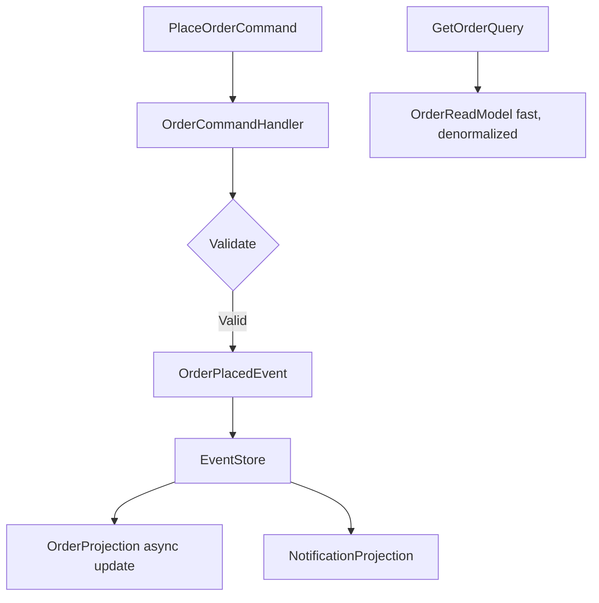

## Object-Oriented Programming Principles

Object-Oriented Programming organizes code around objects with encapsulated state and behavior. Four pillars: encapsulation, inheritance, polymorphism, abstraction.

### The Four Pillars

<CardGroup cols={2}>
  <Card title="Encapsulation" icon="lock">
    Expose behavior, hide state — prefer methods over public fields
  </Card>
  <Card title="Inheritance" icon="diagram-project">
    "is-a" relationship; composition ("has-a") is often more flexible
  </Card>
  <Card title="Polymorphism" icon="shapes">
    Program to interfaces, not implementations
  </Card>
  <Card title="Abstraction" icon="layer-group">
    Name concepts at the right level of detail
  </Card>
</CardGroup>

### Key Principles

- **Liskov Substitution Principle**: Subtypes must be substitutable for base types
- **Favor composition over inheritance** for behavioral reuse

```typescript
// Program to interface, not implementation
interface INotifier { 
  send(msg: Message): void 
}

class EmailNotifier implements INotifier { ... }
class SmsNotifier implements INotifier { ... }

// OrderService doesn't know which notifier it uses
class OrderService {
  constructor(private notifier: INotifier) {}
}
```

<Tip>
When designing a class hierarchy, ask "is this truly an is-a relationship?" — if you're unsure, use composition with dependency injection instead.
</Tip>

## SOLID Principles

SOLID is a mnemonic for five design principles that produce flexible, maintainable, testable object-oriented code.

### Single Responsibility Principle (SRP)

<Note>
A class should have one, and only one, reason to change.
</Note>

SRP violations are the root of most maintenance pain — if a class needs to change for multiple different reasons, it has multiple responsibilities.

### Open-Closed Principle (OCP)

Open for extension via interfaces, closed for modification.

### Liskov Substitution Principle (LSP)

Subtypes must honor the contracts of their base types.

### Interface Segregation Principle (ISP)

Many focused interfaces over one general-purpose interface.

### Dependency Inversion Principle (DIP)

High-level modules depend on abstractions, not concretions.

```typescript
// BAD: high-level module depends on low-level
class OrderService { 
  repo = new SqlOrderRepo() 
}

// GOOD: depend on abstraction
class OrderService {
  constructor(private repo: IOrderRepository) {}
}
```

<Warning>
SRP violations are the root of most maintenance pain — if a class needs to change for multiple different reasons, it has multiple responsibilities.
</Warning>

### Best Practices

<CardGroup cols={2}>
  <Card title="Do" icon="check">
    - Apply DIP via constructor injection — makes dependencies visible
    - Create focused interfaces (ISP) per consuming use case
    - Use OCP: extend via new classes/implementations, not by editing existing ones
  </Card>
  <Card title="Don't" icon="xmark">
    - Apply SOLID dogmatically when it adds complexity without benefit
    - Create thousands of tiny classes with no meaningful domain modeling
    - Over-abstract prematurely — Rule of Three before extracting abstractions
  </Card>
</CardGroup>

## Presentation Layer Patterns

### MVC / MVP / MVVM

MVC, MVP, and MVVM are patterns for separating user interface concerns from application logic, improving testability and maintainability.

<Tabs>
  <Tab title="MVC">
    **Model-View-Controller**
    
    - Controller handles input, creates ViewModel, selects View
    - Separates Models (data), Views (UI), and Controllers (input handling)
  </Tab>
  
  <Tab title="MVP">
    **Model-View-Presenter**
    
    - View is passive; Presenter updates View directly
    - Easier to unit test UI logic
    - Presenter handles all UI logic
  </Tab>
  
  <Tab title="MVVM">
    **Model-View-ViewModel**
    
    - ViewModel exposes observable data; View reacts via binding
    - De facto pattern for data-bound UI frameworks
    - Dominant in WPF, Blazor, React (with stores), and mobile
  </Tab>
</Tabs>

```typescript
// MVVM ViewModel (React + Zustand equivalent)
const useOrderStore = create((set) => ({
    orders: [],
    loading: false,
    fetchOrders: async () => {
        set({ loading: true });
        set({ 
          orders: await api.getOrders(), 
          loading: false 
        });
    }
}));
```

<Tip>
Keep ViewModels ignorant of the UI framework — a ViewModel that can be unit tested without rendering is a sign of clean separation.
</Tip>

## Advanced Architectural Patterns

### CQRS & Eventual Consistency

CQRS separates commands (writes) from queries (reads), allowing each to be optimized independently. Eventual consistency accepts temporary data staleness in exchange for availability and scalability.



**Key Concepts:**

- Command side: validates, executes, emits domain events
- Query side: optimized read models (projections) from event store or replicas
- Eventual consistency: accept that reads may lag writes briefly
- Event Sourcing: store domain events as the source of truth, not current state
- Saga/Process Manager coordinates multi-step distributed transactions

```typescript
// CQRS command + event flow
PlaceOrderCommand
    → OrderCommandHandler
    → validate → OrderPlacedEvent
    → EventStore (persisted)
    → OrderProjection (async update)
    → NotificationProjection

GetOrderQuery → OrderReadModel (fast, denormalised)
```

<Warning>
Don't apply CQRS everywhere — start with a simple layered architecture. Introduce CQRS where read/write load is genuinely asymmetric (100:1 read-to-write ratio).
</Warning>

### Best Practices for CQRS

<CardGroup cols={2}>
  <Card title="Do" icon="check">
    - Design idempotent event consumers from the start
    - Model commands as business intentions, not CRUD operations
    - Use projection rebuilds as a data migration strategy
  </Card>
  <Card title="Don't" icon="xmark">
    - Use CQRS as an excuse to avoid a proper domain model
    - Implement Event Sourcing without understanding its operational complexity
    - Ignore eventual consistency in UX — users need feedback on command outcome
  </Card>
</CardGroup>

## Test-Driven Development (TDD)

TDD writes a failing test for a small behavior, makes it pass with minimum code, then refactors. The cycle produces well-tested, modular, dependency-inverted code.

### Red-Green-Refactor Cycle

1. **Red**: Write a failing test for the next small behavior
2. **Green**: Write minimum code to pass — resist over-engineering
3. **Refactor**: Clean up with confidence — all tests still pass

```typescript
// TDD cycle example (Jest/TypeScript)
// 1. RED: failing test
it('applies 10% discount over £100', () => {
    expect(applyDiscount(120)).toBe(108);
});

// 2. GREEN: minimal implementation
function applyDiscount(total: number) {
    return total > 100 ? total * 0.9 : total;
}

// 3. REFACTOR: improve design while keeping tests green
```

<Note>
Tests should be: **Fast**, **Independent**, **Repeatable**, **Self-verifying**, **Timely** (FIRST)
</Note>

<Tip>
TDD's biggest payoff isn't the tests — it's the design. Code written test-first is almost always more modular and less coupled than code written first and tested after.
</Tip>

### TDD Best Practices

**Do:**
- Name tests as behavior specifications (given/when/then)
- Commit after each Green phase
- Run mutation tests on critical business logic with Stryker/PITest

**Don't:**
- Write tests purely for coverage metrics after the fact
- Create tests that test implementation internals (brittle)
- Skip the Refactor step — it's when design improves

## Domain-Driven Design (DDD)

Domain-Driven Design aligns the software model with the business domain using a shared language (Ubiquitous Language) and tactical patterns for rich domain modeling.

### Strategic Patterns

<CardGroup cols={2}>
  <Card title="Bounded Context" icon="border-all">
    Explicit boundary within which a model is consistent
  </Card>
  <Card title="Ubiquitous Language" icon="language">
    Shared vocabulary between domain experts and developers
  </Card>
  <Card title="Context Mapping" icon="map">
    Relationships between bounded contexts
  </Card>
  <Card title="Anti-corruption Layer" icon="shield">
    Protects a bounded context from external models
  </Card>
</CardGroup>

### Tactical Patterns

- **Aggregate**: Cluster of domain objects with a single root enforcing invariants
- **Entity**: Has identity and lifecycle
- **Value Object**: Defined by its attributes
- **Domain Event**: Records that something meaningful happened in the domain
- **Repository**: Abstracts persistence

```typescript
// Aggregate example
class Order {  // Aggregate Root
    private items: OrderItem[] = [];

    addItem(product: ProductId, qty: Quantity) {
        // enforce invariant: max 10 items
        if (this.items.length >= 10) 
          throw new DomainError('Max items');
        this.items.push(new OrderItem(product, qty));
    }
}
```

<Tip>
Identify bounded contexts by finding where the same word means different things to different teams — "Account" in Billing means something different than in CRM.
</Tip>

### DDD Best Practices

<CardGroup cols={2}>
  <Card title="Do" icon="check">
    - Involve domain experts in model design sessions (Event Storming)
    - Keep aggregates small — load and modify only one aggregate per transaction
    - Model domain concepts explicitly (no generic CRUD services)
  </Card>
  <Card title="Don't" icon="xmark">
    - Create one giant bounded context for the whole system
    - Use database tables as the domain model
    - Introduce DDD tactical patterns without a genuine complex domain
  </Card>
</CardGroup>

## Database Consistency Patterns

### ACID Properties

ACID guarantees database transaction correctness:

- **Atomicity**: All-or-nothing transaction semantics
- **Consistency**: Data moves from one valid state to another
- **Isolation**: Concurrent transactions do not see each other's partial state
- **Durability**: Committed data survives failures

```sql
-- ACID isolation levels (weakest to strongest):
Read Uncommitted → Read Committed → Repeatable Read → Serialisable
```

### CAP Theorem

CAP Theorem states that distributed systems can only guarantee two of: **Consistency**, **Availability**, **Partition Tolerance**.

```yaml
# CAP system examples
CP (Consistent + Partition-tolerant):
    PostgreSQL (single node), Zookeeper, etcd

AP (Available + Partition-tolerant):
    Cassandra, DynamoDB, CouchDB
```

<Tip>
Most systems need AP with eventual consistency for the happy path and CP guarantees for critical data (money, stock levels) — design per use case, not per system.
</Tip>

## Actor Model

The Actor Model structures concurrent systems as independent actors that communicate exclusively via asynchronous message passing, eliminating shared mutable state.

### Key Characteristics

- No shared state between actors — all communication is message-based
- Actors are highly scalable: millions on a single JVM with Akka
- "Let it crash" philosophy: supervisor trees restart failed actors
- Location transparency: actors can be local or remote transparently

```scala
// Akka Typed actor (Scala)
object OrderActor {
    sealed trait Command
    case class PlaceOrder(id: String, replyTo: ActorRef) extends Command

    def apply(): Behavior[Command] = Behaviors.receiveMessage {
        case PlaceOrder(id, replyTo) => 
          ... 
          Behaviors.same
    }
}
```

<Tip>
Use the Actor Model for systems with high concurrency and complex state machines — it eliminates lock-based concurrency bugs by design.
</Tip>
