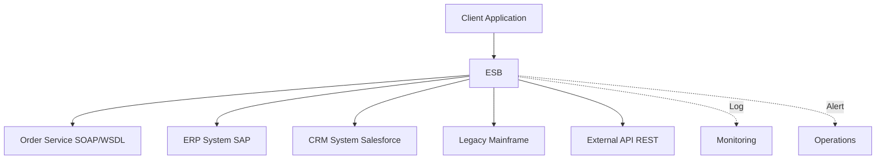

## Enterprise Service Bus (ESB)

Enterprise Service Bus mediates enterprise integrations with routing, transformation, orchestration, and protocol mediation.

### ESB Core Capabilities

<CardGroup cols={2}>
  <Card title="Message Routing" icon="route">
    Content-based routing, rule-based routing, dynamic routing
  </Card>
  <Card title="Transformation" icon="arrows-rotate">
    Schema mapping, protocol conversion, canonical data model
  </Card>
  <Card title="Orchestration" icon="diagram-project">
    Multi-service workflow coordination, business process execution
  </Card>
  <Card title="Protocol Mediation" icon="plug">
    SOAP, REST, MQ, FTP, SFTP, EDI interoperability
  </Card>
</CardGroup>

### ESB Architecture



### Canonical Data Model

Normalize data across heterogeneous systems using a shared schema.

```xml
<!-- Canonical Order Model (XML Schema) -->
<xs:complexType name="CanonicalOrder">
  <xs:sequence>
    <xs:element name="orderId" type="xs:string"/>
    <xs:element name="customerId" type="xs:string"/>
    <xs:element name="orderDate" type="xs:dateTime"/>
    <xs:element name="totalAmount" type="xs:decimal"/>
    <xs:element name="currency" type="xs:string"/>
    <xs:element name="items" type="OrderItems"/>
  </xs:sequence>
</xs:complexType>

<!-- Transform from SAP format to Canonical -->
<!-- Transform from Salesforce format to Canonical -->
<!-- All consumers work with Canonical format -->
```

<Warning>
Avoid putting business logic inside ESB routing scripts ("smart pipe" anti-pattern). ESBs should mediate, not contain business logic.
</Warning>

### ESB vs Microservices

| Aspect | ESB (SOA) | API Gateway (Microservices) |
|--------|-----------|-----------------------------|
| Integration | Centralized smart pipe | Decentralized dumb pipe |
| Services | Coarse-grained | Fine-grained |
| Data | Shared databases | Database per service |
| Governance | Centralized | Decentralized |
| Standards | SOAP/WSDL/WS-* | REST/gRPC/Events |
| Complexity | In the bus | In the services |

<Tip>
When modernizing a legacy SOA system, use the Strangler Fig pattern — route new traffic to new microservices while keeping the ESB for legacy integrations.
</Tip>

## SOAP & WSDL

SOAP is a formal XML-based RPC protocol. WSDL describes operations, schemas, and bindings.

### WSDL Structure

```xml
<!-- WSDL 1.1 Service Definition -->
<definitions xmlns="http://schemas.xmlsoap.org/wsdl/"
             targetNamespace="http://example.com/orders">
  
  <!-- Types: XML Schema definitions -->
  <types>
    <xs:schema targetNamespace="http://example.com/orders">
      <xs:element name="GetOrderRequest">
        <xs:complexType>
          <xs:sequence>
            <xs:element name="orderId" type="xs:string"/>
          </xs:sequence>
        </xs:complexType>
      </xs:element>
      <xs:element name="GetOrderResponse">
        <xs:complexType>
          <xs:sequence>
            <xs:element name="order" type="tns:Order"/>
          </xs:sequence>
        </xs:complexType>
      </xs:element>
    </xs:schema>
  </types>
  
  <!-- Messages -->
  <message name="GetOrderRequestMsg">
    <part name="parameters" element="tns:GetOrderRequest"/>
  </message>
  <message name="GetOrderResponseMsg">
    <part name="parameters" element="tns:GetOrderResponse"/>
  </message>
  
  <!-- Port Type: Operations -->
  <portType name="OrderServicePortType">
    <operation name="GetOrder">
      <input message="tns:GetOrderRequestMsg"/>
      <output message="tns:GetOrderResponseMsg"/>
    </operation>
  </portType>
  
  <!-- Binding: Protocol details -->
  <binding name="OrderServiceBinding" type="tns:OrderServicePortType">
    <soap:binding transport="http://schemas.xmlsoap.org/soap/http"/>
    <operation name="GetOrder">
      <soap:operation soapAction="http://example.com/GetOrder"/>
      <input><soap:body use="literal"/></input>
      <output><soap:body use="literal"/></output>
    </operation>
  </binding>
  
  <!-- Service: Endpoint -->
  <service name="OrderService">
    <port name="OrderServicePort" binding="tns:OrderServiceBinding">
      <soap:address location="http://example.com/services/orders"/>
    </port>
  </service>
</definitions>
```

### WS-Security

SOAP security standards: authentication, signatures, encryption.

```xml
<!-- SOAP Message with WS-Security -->
<soap:Envelope xmlns:soap="http://schemas.xmlsoap.org/soap/envelope/">
  <soap:Header>
    <wsse:Security xmlns:wsse="http://docs.oasis-open.org/wss/...">
      <wsse:UsernameToken>
        <wsse:Username>client123</wsse:Username>
        <wsse:Password Type="PasswordDigest">...</wsse:Password>
        <wsse:Nonce>...</wsse:Nonce>
        <wsse:Created>2024-01-15T10:30:00Z</wsse:Created>
      </wsse:UsernameToken>
    </wsse:Security>
  </soap:Header>
  <soap:Body>
    <GetOrderRequest>
      <orderId>12345</orderId>
    </GetOrderRequest>
  </soap:Body>
</soap:Envelope>
```

<Note>
SOAP/WSDL provides formal contracts and strong typing, but is heavyweight. Use for enterprise B2B integrations where formal contracts are required.
</Note>

## Business Process Management (BPM)

BPM automates multi-step business workflows using executable process models.

### BPMN 2.0

Business Process Model and Notation — graphical workflow notation executed by engines (Camunda, Flowable).

```yaml
# BPMN Process Example: Order Fulfillment

StartEvent → PlaceOrder (ServiceTask)
    ↓
  Gateway [stock available?]
    ↓ Yes                    ↓ No
  ReserveInventory      NotifyBackorder
    ↓                         ↓
  ChargePayment            End
    ↓
  [payment success?]
    ↓ Yes          ↓ No
  ShipOrder    RefundReserve
    ↓                ↓
  SendNotification  End
    ↓
  EndEvent
```

### BPMN Elements

<CardGroup cols={2}>
  <Card title="Events" icon="circle">
    Start, End, Message, Timer, Error, Signal
  </Card>
  <Card title="Activities" icon="square">
    Service Task, User Task, Script Task, Subprocess
  </Card>
  <Card title="Gateways" icon="diamond">
    Exclusive (XOR), Parallel (AND), Inclusive (OR), Event-based
  </Card>
  <Card title="Flows" icon="arrow-right">
    Sequence Flow, Message Flow, Data Association
  </Card>
</CardGroup>

### Camunda BPMN Example

```xml
<!-- Camunda BPMN Process Definition -->
<bpmn:process id="order-fulfillment" name="Order Fulfillment" isExecutable="true">
  
  <bpmn:startEvent id="start" name="Order Received"/>
  
  <bpmn:serviceTask id="checkInventory" name="Check Inventory"
                    camunda:delegateExpression="${inventoryService}">
    <bpmn:incoming>start</bpmn:incoming>
    <bpmn:outgoing>gateway1</bpmn:outgoing>
  </bpmn:serviceTask>
  
  <bpmn:exclusiveGateway id="gateway1" name="Stock available?">
    <bpmn:incoming>checkInventory</bpmn:incoming>
    <bpmn:outgoing>yesFlow</bpmn:outgoing>
    <bpmn:outgoing>noFlow</bpmn:outgoing>
  </bpmn:exclusiveGateway>
  
  <bpmn:sequenceFlow id="yesFlow" sourceRef="gateway1" targetRef="chargePayment">
    <bpmn:conditionExpression>
      ${inventory.available == true}
    </bpmn:conditionExpression>
  </bpmn:sequenceFlow>
  
  <bpmn:serviceTask id="chargePayment" name="Charge Payment"
                    camunda:delegateExpression="${paymentService}">
    <bpmn:incoming>yesFlow</bpmn:incoming>
    <bpmn:outgoing>end</bpmn:outgoing>
  </bpmn:serviceTask>
  
  <bpmn:endEvent id="end" name="Order Complete"/>
  
</bpmn:process>
```

<Tip>
Use Camunda/Flowable for long-running business processes that span days or weeks — databases are not process engines, and implementing state machines manually is fragile.
</Tip>

### BPM Best Practices

<CardGroup cols={2}>
  <Card title="Do" icon="check">
    - Use BPMN for complex multi-step workflows with human approval steps
    - Model processes with business stakeholders using visual tools
    - Version BPMN process definitions
    - Monitor process instances and durations
  </Card>
  <Card title="Don't" icon="xmark">
    - Put business logic inside BPMN scripts (use service tasks)
    - Create overly complex processes (>20 activities)
    - Skip process testing (use Camunda test framework)
  </Card>
</CardGroup>

## Enterprise Application Integration

### Integration Patterns

<Tabs>
  <Tab title="Point-to-Point">
    Direct connections between systems.
    
    **Pros**: Simple, fast
    **Cons**: n(n-1)/2 connections, tight coupling
    
    ```mermaid
    graph LR
        A[System A] <--> B[System B]
        A <--> C[System C]
        B <--> C
        B <--> D[System D]
        C <--> D
    ```
  </Tab>
  
  <Tab title="Hub-and-Spoke (ESB)">
    Central integration hub.
    
    **Pros**: Centralized monitoring, canonical model
    **Cons**: Single point of failure, bottleneck
    
    ```mermaid
    graph TD
        A[System A] --> ESB
        B[System B] --> ESB
        C[System C] --> ESB
        D[System D] --> ESB
        ESB --> A
        ESB --> B
        ESB --> C
        ESB --> D
    ```
  </Tab>
  
  <Tab title="Event-Driven">
    Publish-subscribe via event bus.
    
    **Pros**: Loose coupling, scalable
    **Cons**: Eventual consistency, complexity
    
    ```mermaid
    graph TD
        A[System A] -->|Publish| E[Event Bus]
        E -->|Subscribe| B[System B]
        E -->|Subscribe| C[System C]
        E -->|Subscribe| D[System D]
    ```
  </Tab>
</Tabs>

### File-Based Integration

Batch file transfer for legacy systems.

```yaml
# ETL Job: Daily Order Extract

1. Extract:
   - Query: SELECT * FROM orders WHERE created_at >= YESTERDAY
   - Format: CSV with header
   - Location: /exports/orders_YYYYMMDD.csv

2. Transform:
   - Map fields to canonical model
   - Validate data quality (required fields, formats)
   - Enrich with reference data
   - Handle errors → error file

3. Load:
   - SFTP to partner server: sftp.partner.com/inbox/
   - Send success notification
   - Archive file: /archive/orders_YYYYMMDD.csv
   - Update integration audit log
```

<Warning>
File-based integrations are batch, not real-time. Use APIs or event streams for time-sensitive data.
</Warning>

## Legacy System Integration

### Strangler Fig Pattern

Incrementally replace legacy system without a risky big-bang rewrite.

```yaml
# Phase 1: Proxy
Client → API Gateway → Legacy System

# Phase 2: Intercept & Route
Client → API Gateway → [Router]
                         ├─> New Service (10% traffic)
                         └─> Legacy System (90% traffic)

# Phase 3: Migrate Function by Function
Client → API Gateway → [Router]
                         ├─> New Service A (Orders: 100%)
                         ├─> New Service B (Inventory: 50%)
                         └─> Legacy System (Inventory: 50%, others)

# Phase 4: Complete
Client → API Gateway → New Services (100%)
                       Legacy System decommissioned
```

### Anti-Corruption Layer (ACL)

Protects new system from legacy system's data model.

```typescript
// Anti-Corruption Layer: Translate legacy to domain model

class LegacyOrderAdapter {
  // Legacy system has terrible field names
  toDomainModel(legacyOrder: any): Order {
    return {
      id: legacyOrder.ORD_ID,
      customerId: legacyOrder.CUST_NO,
      total: this.parseAmount(legacyOrder.TOT_AMT_STR), // String to number
      status: this.mapStatus(legacyOrder.STATUS_CD),    // Map codes
      items: legacyOrder.ITEMS?.map(this.mapItem) ?? [],
      createdAt: this.parseDate(legacyOrder.CRT_DT)    // YYYYMMDD to ISO
    };
  }
  
  private mapStatus(code: string): OrderStatus {
    const mapping = {
      'P': OrderStatus.Pending,
      'C': OrderStatus.Confirmed,
      'S': OrderStatus.Shipped,
      'X': OrderStatus.Cancelled
    };
    return mapping[code] ?? OrderStatus.Unknown;
  }
}
```

<Tip>
Always use an Anti-Corruption Layer when integrating with legacy systems — it isolates the domain model from the legacy system's quirks and allows independent evolution.
</Tip>

## Enterprise System Examples

### SAP Integration

<Accordion title="SAP ERP & HANA">
SAP S/4HANA is the modern ERP suite running on the HANA in-memory database.

**Integration Approaches:**

- **OData APIs**: RESTful APIs for CRUD operations
- **BAPIs**: Business APIs (RFC function modules)
- **IDocs**: Asynchronous document exchange
- **SAP BTP**: Integration suite for cloud and hybrid scenarios

```abap
-- SAP HANA CDS View for data exposure
@AbapCatalog.sqlViewName: 'ZORD_ITEMS'
define view Z_OrderItems as
    select from vbap as item
    association to vbak as header
        on header.vbeln = item.vbeln
    { 
      item.vbeln, 
      item.matnr, 
      item.netwr 
    }
```

**Best Practices:**
- Use CDS Views for performant HANA data modeling
- Prefer BTP side-by-side extensions over in-system ABAP customizations
- Use SAP's standard APIs rather than direct table access
</Accordion>

### Salesforce Integration

<Accordion title="Salesforce Platform">
Salesforce CRM with Sales Cloud, Service Cloud, and Lightning Platform.

**Integration Methods:**

- **REST API**: Standard CRUD operations
- **Bulk API**: Large data volumes (millions of records)
- **Streaming API**: Real-time event notifications (PushTopics)
- **Platform Events**: Pub-sub for event-driven architecture
- **Apex REST/SOAP**: Custom web services

```java
// Apex trigger (bulkified for governor limits)
trigger OrderTrigger on Order__c (after insert) {
    Set<Id> accIds = new Set<Id>();
    for (Order__c o : Trigger.new)
        accIds.add(o.AccountId__c);
    
    // Bulk query — never SOQL inside for loop
    for (Account a : [SELECT Id FROM Account WHERE Id IN :accIds]) {
        // Process accounts
    }
}
```

**Best Practices:**
- Bulkify all Apex code — handle lists, not single records
- Use Flows for declarative automation before writing Apex
- Monitor governor limits (100 SOQL queries, 10k DML rows per transaction)
</Accordion>

### Microsoft Dynamics 365

<Accordion title="Dynamics 365 & Power Platform">
Microsoft ERP and CRM built on Azure with Dataverse.

**Integration Approaches:**

- **Web API**: OData 4.0 REST API
- **Plugins**: .NET assemblies in Dataverse event pipeline
- **Power Automate**: Low-code workflow automation
- **Dual-write**: Real-time sync between Finance & Operations and Dataverse
- **Azure Logic Apps**: Enterprise integration workflows

```csharp
// Dynamics 365 Plugin (C#)
public class OrderPlugin : IPlugin {
    public void Execute(IServiceProvider sp) {
        var ctx = (IPluginExecutionContext)sp.GetService(typeof(IPluginExecutionContext));
        var order = (Entity)ctx.InputParameters["Target"];
        
        // Validate or enrich the order entity
        // Register in pre-operation for validation
        // Register in post-operation for side effects
    }
}
```

**Best Practices:**
- Use Dataverse APIs for external integrations
- Use virtual tables to surface external data without ETL
- Register plugins in pre-operation for validation, post-operation for side effects
</Accordion>

## Integration Best Practices

<CardGroup cols={2}>
  <Card title="Design" icon="pen-ruler">
    - Start with domain model, not data model
    - Use canonical data models for many-to-many integrations
    - Document integration contracts (OpenAPI, AsyncAPI)
    - Version all integration APIs
  </Card>
  
  <Card title="Resilience" icon="shield">
    - Implement retry with exponential backoff
    - Use circuit breakers for external calls
    - Design idempotent consumers
    - Configure dead letter queues
  </Card>
  
  <Card title="Security" icon="lock">
    - Use mTLS for service-to-service
    - Implement API key rotation
    - Never pass credentials in URLs
    - Encrypt sensitive data at rest and in transit
  </Card>
  
  <Card title="Operations" icon="gears">
    - Monitor integration health and latency
    - Alert on integration failures
    - Track message flow with correlation IDs
    - Maintain integration audit logs
  </Card>
</CardGroup>
