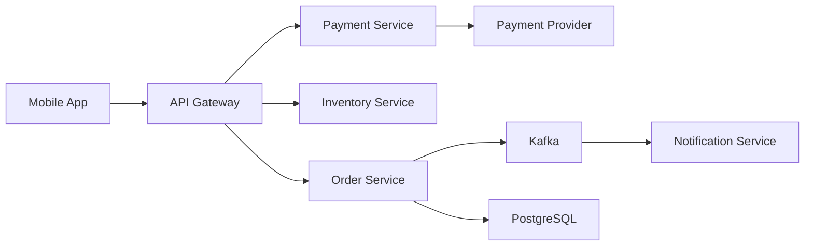

## What is Software Architecture?

Software architecture defines how an application is organized: which components exist, how they communicate, the constraints they operate under, and how quality attributes like scalability, security, and maintainability are achieved.

<Note>
Architecture captures the big decisions that affect every subsequent decision. Every system has an architecture, documented or not.
</Note>

### Core Architecture Concepts

The high-level structure of a software system — its components, their relationships, and the principles governing their design and evolution over time.

**Key Characteristics:**

- Architecture captures the big decisions that are hard to change later
- Components and their interfaces define the system's vocabulary
- Quality attributes (scalability, availability, security) drive architectural choices
- Architecture documentation records the "why" not just the "what"
- Good architecture makes the system easy to understand, change, and deploy

```typescript
// Architecture manifests in structure, not just diagrams
// Layered example:
Presentation → Application → Domain → Infrastructure

// Dependency rule: inner layers must NOT depend on outer layers
class OrderService {               // Domain layer
    constructor(IOrderRepo repo) {}  // depends on abstraction only
}
```

<Tip>
Architecture decisions should be documented with their rationale (Architecture Decision Records - ADRs) so future teams understand why, not just what.
</Tip>

## Architecture Decision Records (ADRs)

ADRs are the most valuable artifact an architect produces. They document significant architectural decisions with context and consequences.

```markdown
// ADR-004: Use event-driven architecture for order processing
// Status: Accepted
// Context: Orders need real-time updates across 5 services
// Decision: Kafka event bus with domain events
// Consequences: Eventual consistency, requires idempotent consumers
```

### Best Practices

<CardGroup cols={2}>
  <Card title="Do" icon="check">
    - Align architecture to business goals and quality requirements
    - Document decisions as ADRs in the codebase
    - Revisit architectural constraints as the system evolves
  </Card>
  <Card title="Don't" icon="xmark">
    - Choose architecture based on hype rather than requirements
    - Over-engineer for scale you don't yet need
    - Leave architecture implicit and undocumented
  </Card>
</CardGroup>

## Architecture Levels

### Application Architecture

Application-level architecture concerns how a single application is structured internally: its layers, modules, dependencies, and internal communication patterns.

**Key Patterns:**

- Hexagonal architecture separates core domain from infrastructure ports
- Clean Architecture enforces unidirectional dependencies via dependency inversion
- MVC/MVVM patterns separate presentation from logic
- Vertical slice architecture organizes by feature rather than layer
- Module boundaries should align with domain concepts, not technical tiers
- Dependency injection enables testability and loose coupling

```typescript
// Clean Architecture dependency flow
Domain      → no dependencies
Application → depends on Domain interfaces
Infrastructure → implements Domain interfaces
Presentation  → depends on Application use cases

// Use case example (Application layer)
class PlaceOrderUseCase {
    execute(cmd: PlaceOrderCommand): OrderId { ... }
}
```

<Tip>
Draw your application's dependency diagram — if arrows point in multiple directions, you have hidden coupling that will cause pain during refactoring.
</Tip>

### Solution Architecture

Solution architecture designs how multiple applications, services, and systems work together to deliver a business capability across an organization.



**Key Concerns:**

- Solution architecture spans multiple applications and services
- Integration patterns (APIs, events, ETL) are primary design concerns
- Capacity planning bridges business demand to infrastructure sizing
- Solution architects own the solution's build-vs-buy decisions
- Non-functional requirements (SLAs, RPO/RTO) drive solution design

<Warning>
Always define and document the failure modes of each integration point — the most common cause of production incidents is unexpected external dependency failures.
</Warning>

### Enterprise Architecture

Enterprise architecture aligns technology strategy with business goals across the entire organization, establishing standards, roadmaps, and governance frameworks.

**TOGAF ADM Domains (BDAT):**

- **Business Architecture**: capabilities, processes, org structure
- **Data Architecture**: data models, flows, governance
- **Application Architecture**: portfolio, integrations, roadmap
- **Technology Architecture**: platforms, infrastructure, standards

```yaml
# TOGAF ADM cycle phases
Preliminary: framework setup, principles
Phase A: architecture vision, stakeholders
Phase B: business architecture (capabilities)
Phase C: information systems architecture
Phase D: technology architecture
Phase E/F: opportunities, roadmap
Phase G/H: governance, change management
```

<Tip>
EA delivers most value through a living Technology Radar, not exhaustive documentation — focus on actionable standards and clear retire/invest signals.
</Tip>

## The Software Architect Role

A software architect makes significant structural and technical decisions, sets standards, defines platforms, and bridges business needs with technical solutions.

### Core Responsibilities

**Decision Making:**
- Architects make high-stakes decisions with long-term consequences
- They translate business requirements into technical constraints
- Risk management is a core architect responsibility

**Leadership:**
- Influence without authority is key — leading through expertise, not mandate
- Architects must code to stay credible and grounded in reality
- The role spans multiple teams, systems, and stakeholders

**Key Activities:**

<Accordion title="Requirements Elicitation">
Uncovers non-functional requirements (NFRs) often missed by business analysts.
</Accordion>

<Accordion title="Standards Enforcement">
Most effective when automated through linting and gates.
</Accordion>

<Accordion title="Architecture Documentation">
Targets different audiences: developers vs. executives.
</Accordion>

<Accordion title="Developer Coaching">
Multiplies the architect's impact across the team.
</Accordion>

### Architecture Review Checklist

```yaml
☐ NFRs captured and measurable (latency < 200ms P99)
☐ Data flows documented and ownership clear
☐ Integration failure modes identified
☐ Security threat model reviewed
☐ Operational runbook exists
☐ ADR written for significant decisions
```

<Tip>
Automate standards enforcement via CI gates and static analysis — manual code review for standards compliance doesn't scale and creates bottlenecks.
</Tip>

## Essential Architect Skills

Effective architects combine technical depth (design, coding, estimation) with soft skills (communication, coaching, balance) and strategic thinking (simplicity, decision quality).

### Technical Skills

- Decision-making under uncertainty is a core architectural skill
- Simplification is harder than complexity — ruthlessly prioritize
- Estimation accuracy improves with experience and explicit assumptions

### Soft Skills

- Communication: architects must speak to engineers, managers, and executives differently
- Coaching developers is a force multiplier for architecture quality
- Technical marketing: selling ideas internally requires narrative skill

### Trade-off Analysis

```yaml
# Architecture Trade-off example (ATAM approach)
Quality Attribute: Availability (99.9% SLA)

Option A: Active-active multi-region 
  → cost: high, complexity: high
  
Option B: Active-passive failover 
  → cost: medium, RTO: 5 min
  
Option C: Single region + retry 
  → cost: low, risk: downtime

# Decision: Option B — balances cost vs. SLA requirement
```

<Tip>
Practice explaining architectural decisions to a non-technical audience — if you can't, you don't understand the trade-offs well enough yet.
</Tip>

## Best Practices

<CardGroup cols={2}>
  <Card title="Do These" icon="thumbs-up">
    - Document assumptions alongside decisions
    - Seek out the simplest solution that satisfies the constraints
    - Build a personal reading habit across architecture, business, and communication
    - Stay technically current by writing and reviewing code
    - Make trade-offs explicit rather than pretending they don't exist
  </Card>
  
  <Card title="Avoid These" icon="thumbs-down">
    - Optimize for technical elegance over business value
    - Make irreversible decisions without stakeholder buy-in
    - Underestimate the cost of architectural complexity
    - Disappear into ivory-tower design without developer involvement
    - Block progress by requiring approval for every technical choice
  </Card>
</CardGroup>
