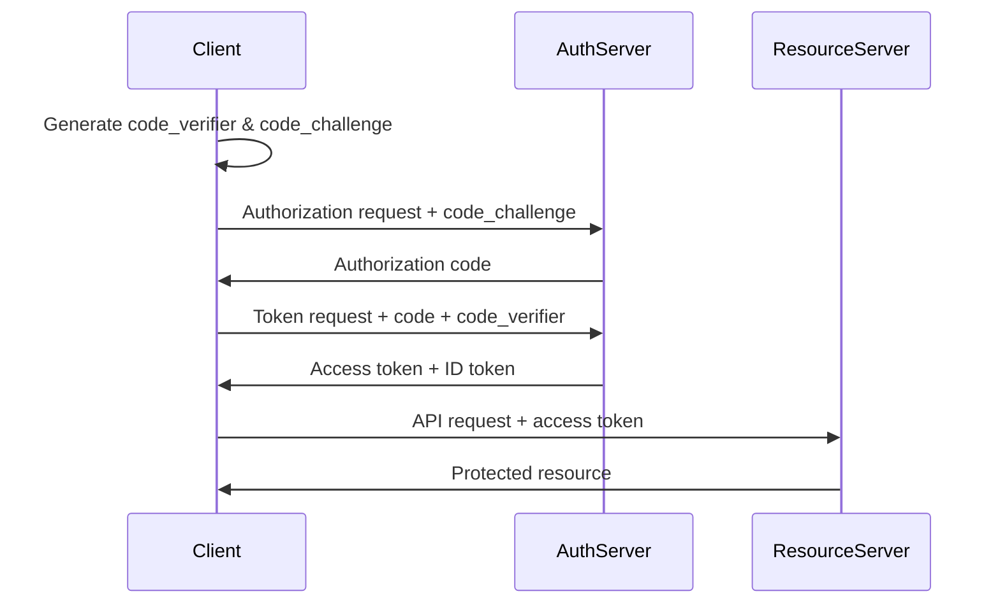

## Cryptographic Foundations

### Hashing Algorithms

Hash functions produce fixed-length digests from arbitrary input. Cryptographic hash functions are one-way and collision-resistant, used for integrity verification and password storage.

<CardGroup cols={2}>
  <Card title="SHA-256/SHA-512" icon="fingerprint">
    Secure for integrity checks, digital signatures, TLS
  </Card>
  <Card title="Argon2id" icon="key">
    Winner of Password Hashing Competition, OWASP recommended 2023
  </Card>
  <Card title="bcrypt" icon="lock">
    Time-tested, but limited to 72-byte passwords
  </Card>
  <Card title="PBKDF2" icon="shield">
    NIST-approved, mandatory for FIPS compliance
  </Card>
</CardGroup>

<Warning>
Never use MD5 or SHA-1 for security — trivially broken. Use SHA-256 minimum for integrity, Argon2id for passwords.
</Warning>

### Password Hashing with Argon2id

```typescript
// Password hashing with Argon2id (Node.js)
import { hash, verify } from 'argon2';

const hashed = await hash(password, {
    type: argon2id,
    memoryCost: 65536,  // 64MB
    timeCost:   3,       // iterations
    parallelism: 4,
});

const valid = await verify(hashed, password);
```

<Tip>
Use constant-time comparison functions when comparing hash digests — timing attacks can recover secrets from variable-time comparisons even over a network.
</Tip>

### Best Practices for Hashing

**Do:**
- Use Argon2id for new password storage implementations
- Store hashes as opaque strings — include algorithm and parameters in the hash string
- Use timing-safe comparison functions for hash verification
- Add a pepper (server-side secret) stored separately from hash

**Don't:**
- Use MD5 or SHA-1 for any security purpose
- Use the same hash function for both integrity and password storage
- Store plaintext passwords or use reversible encryption

## Public Key Infrastructure (PKI)

PKI uses asymmetric cryptography to establish trust, encrypt communications, and verify identities via certificates signed by trusted Certificate Authorities.

### X.509 Certificates

Certificates bind a public key to an identity with CA signature:

```yaml
Certificate Components:
  - Subject: CN=api.example.com
  - Issuer: CN=Let's Encrypt Authority X3
  - Public Key: RSA 2048-bit or ECDSA P-256
  - Validity: Not Before / Not After
  - Signature: CA's digital signature
  - Extensions: SAN (Subject Alternative Names)
```

### TLS/HTTPS Best Practices

<Note>
TLS 1.3 is mandatory — TLS 1.0/1.1 are deprecated and insecure. Only use TLS 1.2+ in production.
</Note>

```yaml
# Nginx TLS configuration
server {
    listen 443 ssl http2;
    
    ssl_certificate     /etc/ssl/cert.pem;
    ssl_certificate_key /etc/ssl/key.pem;
    
    # TLS versions
    ssl_protocols TLSv1.2 TLSv1.3;
    
    # Cipher suites (prefer ECDHE for forward secrecy)
    ssl_ciphers 'ECDHE-ECDSA-AES128-GCM-SHA256:ECDHE-RSA-AES128-GCM-SHA256';
    ssl_prefer_server_ciphers off;
    
    # HSTS (force HTTPS)
    add_header Strict-Transport-Security "max-age=31536000; includeSubDomains" always;
}
```

### Mutual TLS (mTLS)

Client and server both present certificates; used in service mesh for zero-trust networking.

```yaml
# Envoy proxy mTLS configuration
transport_socket:
  name: envoy.transport_sockets.tls
  typed_config:
    common_tls_context:
      tls_certificates: 
        - certificate_chain: { filename: "/etc/ssl/cert.pem" }
          private_key: { filename: "/etc/ssl/key.pem" }
      validation_context:
        trusted_ca: { filename: "/etc/ssl/ca.pem" }
```

<Tip>
Automate certificate renewal (certbot, cert-manager in Kubernetes) — manual certificate management causes more production outages than most bugs.
</Tip>

### PKI Best Practices

<CardGroup cols={2}>
  <Card title="Do" icon="check">
    - Automate certificate renewal before 30-day expiry
    - Use mTLS for service-to-service authentication in microservices
    - Store private keys in HSMs or cloud KMS (AWS KMS, Azure Key Vault)
    - Enable Certificate Transparency (CT) logs
  </Card>
  <Card title="Don't" icon="xmark">
    - Use self-signed certificates in production without a private CA
    - Commit private keys or certificates to version control
    - Use TLS versions below 1.2
  </Card>
</CardGroup>

## OWASP Top 10

OWASP Top 10 identifies the most critical web application security vulnerabilities.

### A01: Broken Access Control

Insecure Direct Object Reference (IDOR), missing authorization checks.

```typescript
// VULNERABLE: No authorization check
app.get('/orders/:id', async (req, res) => {
  const order = await db.orders.findById(req.params.id);
  res.json(order);  // Any user can access any order!
});

// SECURE: Verify ownership
app.get('/orders/:id', async (req, res) => {
  const order = await db.orders.findById(req.params.id);
  
  if (order.userId !== req.user.id) {
    throw new ForbiddenError('Not authorized');
  }
  
  res.json(order);
});
```

### A03: Injection

SQL, NoSQL, LDAP, OS command injection.

```typescript
// VULNERABLE: SQL Injection
db.query(`SELECT * FROM users WHERE id = ${userId}`);

// SAFE: Parameterized query
db.query('SELECT * FROM users WHERE id = $1', [userId]);

// VULNERABLE: NoSQL Injection (MongoDB)
db.users.find({ username: req.body.username });
// Attack: {username: {$ne: null}} returns all users

// SAFE: Strict input validation
const username = String(req.body.username);
db.users.find({ username });
```

<Warning>
Parameterize all database queries — never concatenate user input. This prevents SQL/NoSQL injection attacks.
</Warning>

### A07: Authentication Failures

Credential stuffing, weak passwords, broken session management.

```typescript
// Password policy enforcement
function validatePassword(password: string): boolean {
  return password.length >= 12 &&
         /[a-z]/.test(password) &&
         /[A-Z]/.test(password) &&
         /[0-9]/.test(password) &&
         /[^a-zA-Z0-9]/.test(password);
}

// Rate limiting on authentication
const limiter = rateLimit({
  windowMs: 15 * 60 * 1000,  // 15 minutes
  max: 5,  // 5 attempts
  message: 'Too many login attempts'
});

app.post('/login', limiter, async (req, res) => {
  // ... authentication logic
});
```

### Security Headers

```typescript
// Essential security headers
app.use((req, res, next) => {
  // Prevent MIME sniffing
  res.setHeader('X-Content-Type-Options', 'nosniff');
  
  // XSS Protection
  res.setHeader('X-XSS-Protection', '1; mode=block');
  
  // Clickjacking protection
  res.setHeader('X-Frame-Options', 'DENY');
  
  // CSP
  res.setHeader('Content-Security-Policy', 
    "default-src 'self'; script-src 'self' 'unsafe-inline'");
  
  // HSTS
  res.setHeader('Strict-Transport-Security', 
    'max-age=31536000; includeSubDomains');
  
  next();
});
```

<Tip>
Integrate OWASP ZAP or Semgrep into CI pipelines for automated security scanning — fixing vulnerabilities during development is 10x cheaper than post-deployment.
</Tip>

## Authentication & Authorization

Authentication verifies identity; authorization determines permissions.

### OAuth 2.0 with PKCE

OAuth 2.0 PKCE flow is secure for SPAs and mobile clients (replaces implicit flow).



### OpenID Connect (OIDC)

OIDC adds authentication on top of OAuth 2.0.

- **ID Token**: Who you are (JWT with user claims)
- **Access Token**: What you can do (opaque or JWT)
- **Refresh Token**: Long-lived token to get new access tokens

### JWT Validation

<Warning>
JWT validation: verify signature, issuer, audience, expiry — never skip any check.
</Warning>

```typescript
// JWT validation (must check ALL fields)
import jwt from 'jsonwebtoken';

const payload = jwt.verify(token, publicKey, {
    algorithms: ['RS256'],   // asymmetric only, never HS256 for multi-service
    issuer:     'https://auth.example.com',
    audience:   'api.example.com',
    // throws if invalid, expired, wrong issuer/audience
});

// Never use HS256 (symmetric) for distributed systems
// Use RS256 (asymmetric) so services don't need the signing key
```

### Token Storage

<Tabs>
  <Tab title="HttpOnly Cookies (Recommended)">
    ```typescript
    res.cookie('access_token', token, {
      httpOnly: true,     // Not accessible to JavaScript
      secure: true,       // HTTPS only
      sameSite: 'strict', // CSRF protection
      maxAge: 3600000     // 1 hour
    });
    ```
  </Tab>
  
  <Tab title="LocalStorage (Risky)">
    ```typescript
    // VULNERABLE to XSS attacks
    localStorage.setItem('access_token', token);
    
    // If you must use localStorage (SPA):
    // - Use short-lived access tokens (5-15 min)
    // - Implement token refresh flow
    // - Enable strict CSP
    ```
  </Tab>
</Tabs>

<Tip>
Never store JWTs in localStorage — use HttpOnly cookies with SameSite=Strict for browser auth. If you must use localStorage (SPA), use short-lived access tokens.
</Tip>

### RBAC vs ABAC

<Tabs>
  <Tab title="RBAC (Role-Based)">
    ```typescript
    // Simple role-based access control
    enum Role {
      Admin = 'admin',
      Editor = 'editor',
      Viewer = 'viewer'
    }
    
    function authorize(user: User, requiredRole: Role) {
      const roleHierarchy = {
        admin: 3,
        editor: 2,
        viewer: 1
      };
      
      return roleHierarchy[user.role] >= roleHierarchy[requiredRole];
    }
    ```
  </Tab>
  
  <Tab title="ABAC (Attribute-Based)">
    ```typescript
    // Attribute-based access control
    function authorize(user: User, resource: Resource, action: string) {
      // Check multiple attributes
      if (action === 'edit') {
        return user.department === resource.department &&
               user.level >= 3;
      }
      
      if (action === 'delete') {
        return user.role === 'admin' ||
               (user.id === resource.ownerId && user.level >= 5);
      }
      
      return false;
    }
    ```
  </Tab>
</Tabs>

### Zero Trust Architecture

<Note>
Zero Trust: Verify every request regardless of network location. Never trust, always verify.
</Note>

**Principles:**

1. **Verify explicitly**: Always authenticate and authorize based on all available data points
2. **Use least privilege access**: Limit user access with Just-In-Time and Just-Enough-Access (JIT/JEA)
3. **Assume breach**: Minimize blast radius and segment access

## Security Best Practices

<CardGroup cols={2}>
  <Card title="Input Validation" icon="filter">
    - Validate all user input at API boundaries
    - Use Zod/Joi for runtime schema validation
    - Sanitize HTML input to prevent XSS
    - Use parameterized queries for SQL
  </Card>
  
  <Card title="Secret Management" icon="key">
    - Never commit secrets to version control
    - Use environment variables or secret managers (Vault, AWS Secrets Manager)
    - Rotate secrets regularly
    - Use different secrets per environment
  </Card>
  
  <Card title="Rate Limiting" icon="gauge-high">
    - Apply rate limiting on all public endpoints
    - Stricter limits on authentication endpoints
    - Use distributed rate limiting (Redis) for multi-instance
    - Return 429 Too Many Requests
  </Card>
  
  <Card title="Logging & Monitoring" icon="chart-line">
    - Log all authentication attempts
    - Never log sensitive data (passwords, tokens, PII)
    - Monitor for unusual patterns
    - Set up alerts for security events
  </Card>
</CardGroup>

### Security Checklist

```yaml
☐ All database queries use parameterized statements
☐ Authentication endpoints have rate limiting
☐ TLS 1.2+ only, TLS 1.3 preferred
☐ Security headers configured (CSP, HSTS, X-Frame-Options)
☐ Input validation on all API endpoints
☐ Secrets stored in secret manager, not environment variables
☐ OWASP ZAP/Semgrep integrated in CI pipeline
☐ Regular dependency updates (Dependabot/Renovate)
☐ Principle of least privilege applied to all service accounts
☐ mTLS for service-to-service communication
```
